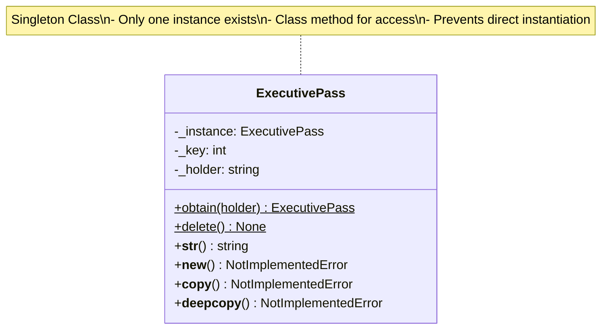

# Executive Module - Singleton Design Pattern Implementation

This module demonstrates the **Singleton Design Pattern** in the context of an executive pass system for sports events. The `ExecutivePass` class ensures that only one instance of the pass exists at any time, controlling access to exclusive executive privileges.

## Key Features:
- **Singleton Pattern**: Guarantees a single instance of the executive pass
- **Controlled Creation**: Prevents explicit instantiation and copying
- **Dynamic Assignment**: Pass can be obtained by different holders
- **Instance Management**: Methods to obtain and delete the singleton instance

## How It Works:
- The `ExecutivePass` class uses a class-level `_instance` variable to store the single instance
- `obtain(holder)` method creates the instance if it doesn't exist, or returns the existing one
- The instance includes a randomly generated key for uniqueness
- `delete()` method resets the singleton, allowing a new instance to be created later
- Explicit instantiation, copying, and deep copying are prevented via overridden methods

## UML Diagram

## Design Pattern Implementation:
- **Singleton Pattern**: The class maintains its own single instance and provides global access
- **Class Methods**: `obtain()` and `delete()` are class methods for instance management
- **Private Constructor**: `__new__()` raises error to prevent explicit creation
- **Copy Prevention**: `__copy__()` and `__deepcopy__()` prevent duplication
- **Lazy Initialization**: Instance is created only when first requested

This design ensures that executive privileges are exclusive and controlled, preventing multiple simultaneous executive accesses. The singleton pattern is ideal for resources that should have exactly one instance, like database connections, configuration managers, or in this case, exclusive access passes.