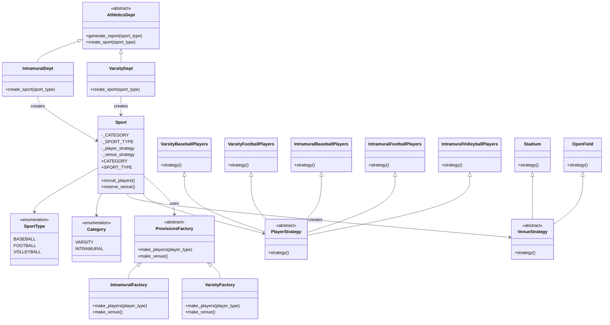

# Sports Application

This is a **Sports Application** built in Python that demonstrates both the **Factory** and **Strategy** design patterns. The application simulates an athletics department that manages different sports programs with varying categories and sport types.

## Installation

1. Ensure you have Python 3.x installed on your system.
2. Clone or download this repository.
3. No additional dependencies are required as the application uses only standard Python libraries.

## Usage

To run the application and generate sample reports:

```bash
python main.py
```

This will output reports for various sport combinations, showing recruited players and reserved venues.

## Sample Output

```
VARSITY BASEBALL
  players: varsity Baseball players
       venue: stadium

VARSITY FOOTBALL
  players: varsity football players
       venue: stadium

INTRAMURAL BASEBALL
  players: Intramural baseball players
       venue: open field

INTRAMURAL FOOTBALL
  players: Intramural football players
       venue: open field

INTRAMURAL VOLLEYBALL
  players: Intramural volleyball players
       venue: open field
```

## Project Structure

```
Sports Application/
├── main.py                 # Entry point of the application
├── athletics_dept.py       # Abstract and concrete department classes
├── sport.py                # Base Sport class and enumerations
├── sports.py               # Concrete sport subclasses
├── provisions_factory.py   # Abstract factory and concrete factories
├── player_strategy.py      # Player recruitment strategies
├── venue_strategy.py       # Venue reservation strategies
├── README.md               # This file
└── __pycache__/            # Python bytecode cache
```

## Key Features:
- **Sports Categories**: Varsity (competitive) and Intramural (recreational)
- **Sport Types**: Baseball, Football, and Volleyball
- **Factory Pattern**: Department classes create sport objects and provide factories for strategy creation
- **Strategy Pattern**: Sport objects delegate player recruitment and venue reservation to strategy objects

## How It Works:
- `main.py` builds two departments: `VarsityDept` and `IntramuralDept`
- Each department chooses the right sport type and instantiates a concrete `Sport` subclass
- Each sport is constructed with a `ProvisionsFactory` that creates:
  - the correct `PlayerStrategy`
  - the correct `VenueStrategy`
- The `Sport` base class uses the factory to build strategies, then delegates behavior to them
- `generate_report()` prints the sport category, sport type, recruited players, and reserved venue

## UML Diagram



## Design Pattern Implementation:
- **Factory Pattern**: `VarsityDept` and `IntramuralDept` create concrete `Sport` objects and pass a `ProvisionsFactory` to the sport constructor.
- **Abstract Factory Pattern**: `ProvisionsFactory` creates player and venue strategies based on `SportType`, allowing strategy creation to be centralized and swapped by department.
- **Strategy Pattern**: The `Sport` class delegates player recruitment and venue reservation to strategy objects returned by the factory.
- **Inheritance and Composition**: Departments inherit from `AthleticsDept`; sports inherit from `Sport`; sport behavior is composed from strategies.

This design separates object creation from behavior, making it easy to extend with new sport categories, sport types, player strategies, or venue strategies without changing existing classes.
