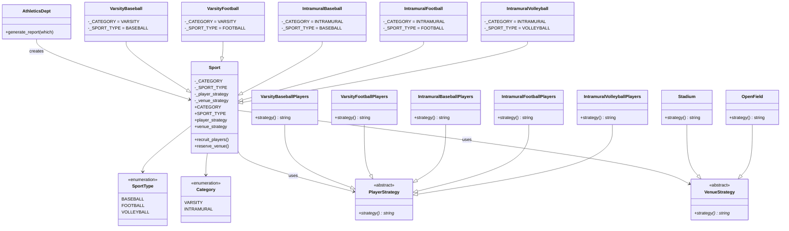

# Sports Application

This is a **Sports Application** built in Python that demonstrates the **Strategy design pattern**. The application simulates an athletics department that manages different sports programs with varying categories and types.

## Installation

1. Ensure you have Python 3.x installed on your system.
2. Clone or download this repository.
3. No additional dependencies are required as the application uses only standard Python libraries.

## Usage

To run the application and generate sample reports:

```bash
python main.py
```

This will output reports for various sport combinations, showing recruited players and reserved venues.

## Sample Output

```
VARSITY BASEBALL
  players: varsity Baseball players
       venue: stadium

VARSITY FOOTBALL
  players: varsity football players
       venue: stadium

INTRAMURAL BASEBALL
  players: Intramural baseball players
       venue: open field

INTRAMURAL FOOTBALL
  players: Intramural football players
       venue: open field

INTRAMURAL VOLLEYBALL
  players: Intramural volleyball players
       venue: open field
```

## Project Structure

```
Sports Application/
├── main.py                 # Entry point of the application
├── athletics_dept.py       # AthleticsDept class for generating reports
├── sport.py                # Base Sport class and enums
├── sports.py               # Concrete sport implementations
├── player_strategy.py      # Player recruitment strategies
├── venue_strategy.py       # Venue reservation strategies
├── README.md               # This file
└── __pycache__/            # Python bytecode cache
```

## Key Features:
- **Sports Categories**: Varsity (competitive) and Intramural (recreational)
- **Sport Types**: Baseball, Football, and Volleyball
- **Dynamic Strategies**: Each sport uses different strategies for:
  - **Player Recruitment**: Different approaches for varsity vs. intramural players
  - **Venue Reservation**: Stadiums for varsity sports, open fields for intramural

## How It Works:
- The `AthleticsDept` class generates reports for specific sport combinations
- Each sport is represented by a concrete class (e.g., `VarsityBaseball`, `IntramuralVolleyball`)
- Sports use composition with strategy objects for player and venue management
- Running `main.py` generates sample reports showing the recruited players and reserved venues for each sport category/type combination

## UML Diagram



## Design Pattern Implementation:
- **Strategy Pattern**: The `Sport` class delegates player recruitment and venue reservation to strategy objects, allowing runtime changes in behavior
- **Inheritance**: Concrete sports inherit from the base `Sport` class
- **Composition**: Sports are composed with strategy objects rather than inheriting behavior

This design allows easy extension of new sports or strategies without modifying existing code, following the Open/Closed Principle.
