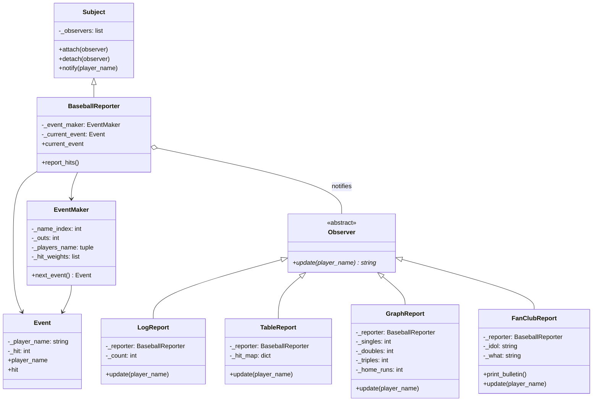

# Notifications Module - Observer Pattern Implementation

This module demonstrates the **Observer Design Pattern** in the context of a baseball game reporting system. It simulates a baseball game where various observers (reporters) monitor and report on player hit events in different formats.

## Key Features:
- **Observer Pattern**: Decouples the subject (game events) from its observers (reporters)
- **Multiple Report Types**: Log, Table, Graph, and Fan Club reports
- **Event-Driven**: Observers react to hit events as they occur
- **Dynamic Attachment**: Observers can attach/detach from the subject at runtime

## How It Works:
- The `BaseballReporter` (Subject) generates simulated baseball events using `EventMaker`
- Each event represents a player's at-bat result (out, single, double, triple, or home run)
- Attached observers receive notifications and update their reports accordingly
- Different observers produce different output formats:
  - **LogReport**: Sequential list of all hits
  - **TableReport**: Tabular summary by player
  - **GraphReport**: Bar chart visualization of hit types
  - **FanClubReport**: Special bulletin for a specific player's first hit

## UML Diagram

## Design Pattern Implementation:
- **Observer Pattern**: The `Subject` class manages a list of observers and notifies them of changes
- **Abstract Base Classes**: `Observer` defines the interface for all concrete observers
- **Composition**: Observers maintain a reference to the subject for accessing event details
- **Loose Coupling**: Subject and observers are independent; new observers can be added without modifying the subject

This design allows easy extension with new report types and promotes maintainable, modular code following the Open/Closed Principle.