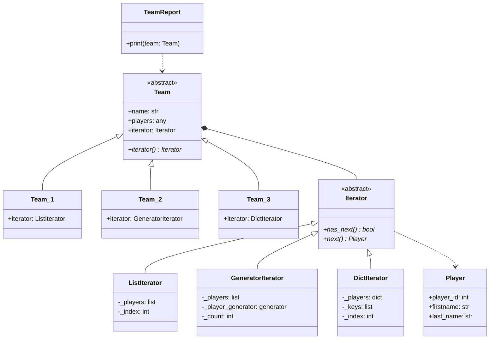

# Players Program

## Description

This program demonstrates the management of sports teams and their players using different data structures for storage. It includes three teams (Team_1, Team_2, Team_3), each storing player information in a different way:

- **Team_1**: Stores players as a list of tuples (player_id, last_name, first_name)
- **Team_2**: Also stores players as a list of tuples, but uses a generator-based iterator
- **Team_3**: Stores players as a dictionary with player_id as keys and namedtuples for names

The program provides a uniform way to iterate over players in each team, regardless of the internal storage mechanism, and includes a reporting feature to print team rosters.

## Design Pattern Used

This program implements the **Iterator Design Pattern**. The Iterator pattern provides a way to access the elements of an aggregate object sequentially without exposing its underlying representation. It allows clients to traverse different data structures (lists, generators, dictionaries) using the same interface.

Key components:
- **Iterator**: Abstract base class defining the iteration interface (has_next, next)
- **Concrete Iterators**: ListIterator, GeneratorIterator, DictIterator - each tailored to a specific data structure
- **Aggregate (Team)**: Abstract class that provides an iterator method
- **Concrete Aggregates**: Team_1, Team_2, Team_3 - each returns an appropriate iterator

## UML Class Diagram

