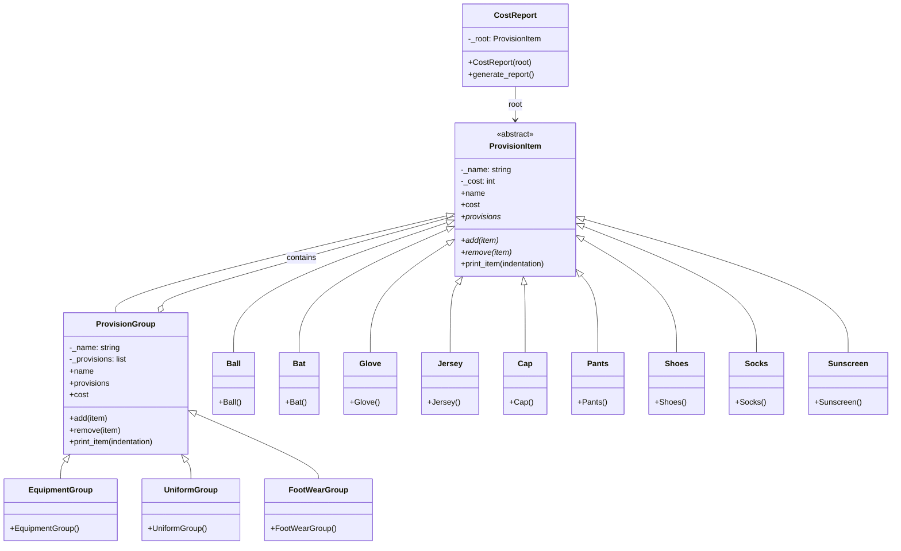

# Provisions Module - Composite Design Pattern Implementation

This module demonstrates the **Composite Design Pattern** in the context of sports team provisions management. It creates a hierarchical structure of provision items (equipment, uniforms, footwear, etc.) where individual items and groups of items can be treated uniformly for cost calculation and reporting.

## Key Features:
- **Composite Pattern**: Treats individual items and groups of items uniformly
- **Hierarchical Structure**: Provisions organized in tree-like structure
- **Recursive Cost Calculation**: Total costs computed by summing child costs
- **Dynamic Composition**: Groups can contain items or other groups

## How It Works:
- `ProvisionItem` is the component interface with `cost` property and `print_item()` method
- Leaf classes (Ball, Bat, Glove, Jersey, Cap, Pants, Shoes, Socks, Sunscreen) represent individual items
- `ProvisionGroup` is the composite that can contain multiple `ProvisionItem`s
- Specific group classes (EquipmentGroup, UniformGroup, FootWearGroup) extend ProvisionGroup
- `CostReport` traverses the composite structure to generate hierarchical cost reports

## UML Diagram

## Design Pattern Implementation:
- **Composite Pattern**: `ProvisionGroup` (composite) and individual items (leaves) implement the same `ProvisionItem` interface
- **Recursive Structure**: Composites can contain other composites, allowing arbitrary nesting
- **Uniform Treatment**: Clients can treat individual items and groups identically
- **Shared Interface**: All components support `cost` calculation and `print_item()` display
- **Tree Traversal**: `CostReport` uses the composite structure to generate hierarchical reports

This design allows flexible organization of provisions into categories and subcategories, with automatic cost aggregation and consistent reporting. The composite pattern is ideal for representing part-whole hierarchies where clients need to treat individual objects and compositions uniformly.