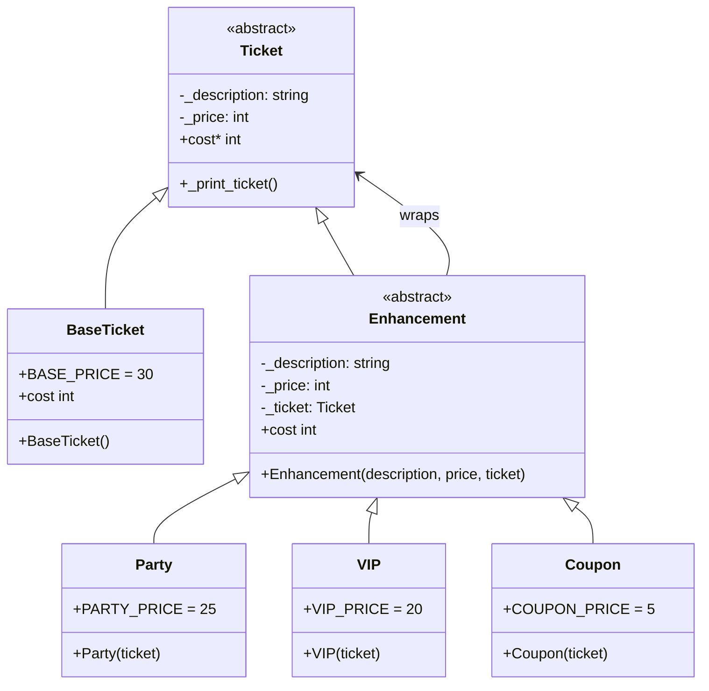

# Ticket Category Module - Decorator Design Pattern Implementation

This module demonstrates the **Decorator Design Pattern** in the context of sports event ticket enhancements. It allows dynamic addition of features (VIP seating, party access, drink coupons) to base tickets without modifying the existing ticket classes.

## Key Features:
- **Decorator Pattern**: Adds responsibilities to objects dynamically
- **Flexible Composition**: Multiple enhancements can be stacked on a single ticket
- **Cost Accumulation**: Each decorator adds its cost to the total price
- **Transparent Wrapping**: Decorators maintain the same interface as the component

## How It Works:
- `Ticket` is the abstract component with `cost` property
- `BaseTicket` is the concrete component representing a basic ticket
- `Enhancement` is the abstract decorator that wraps a `Ticket`
- Concrete decorators (`Party`, `VIP`, `Coupon`) add specific features and costs
- Each decorator delegates to the wrapped ticket while adding its own contribution
- Multiple decorators can be chained to create complex ticket configurations

## UML Diagram

## Design Pattern Implementation:
- **Decorator Pattern**: `Enhancement` classes wrap `Ticket` objects, adding behavior transparently
- **Recursive Composition**: Decorators can wrap other decorators, allowing unlimited stacking
- **Interface Preservation**: All decorators implement the same `Ticket` interface
- **Dynamic Enhancement**: Features are added at runtime without subclassing
- **Cost Delegation**: Each decorator adds its cost to the wrapped ticket's cost

This design allows flexible ticket customization where customers can mix and match enhancements (VIP seating, party access, drink coupons) to create personalized tickets. The decorator pattern enables this extensibility without creating an explosion of subclasses for every possible combination.