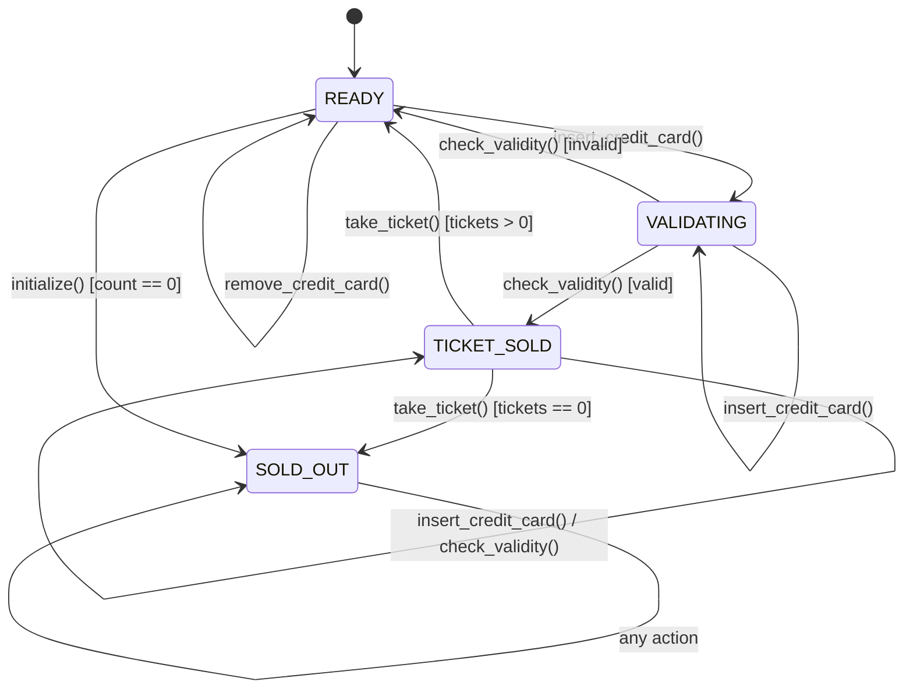
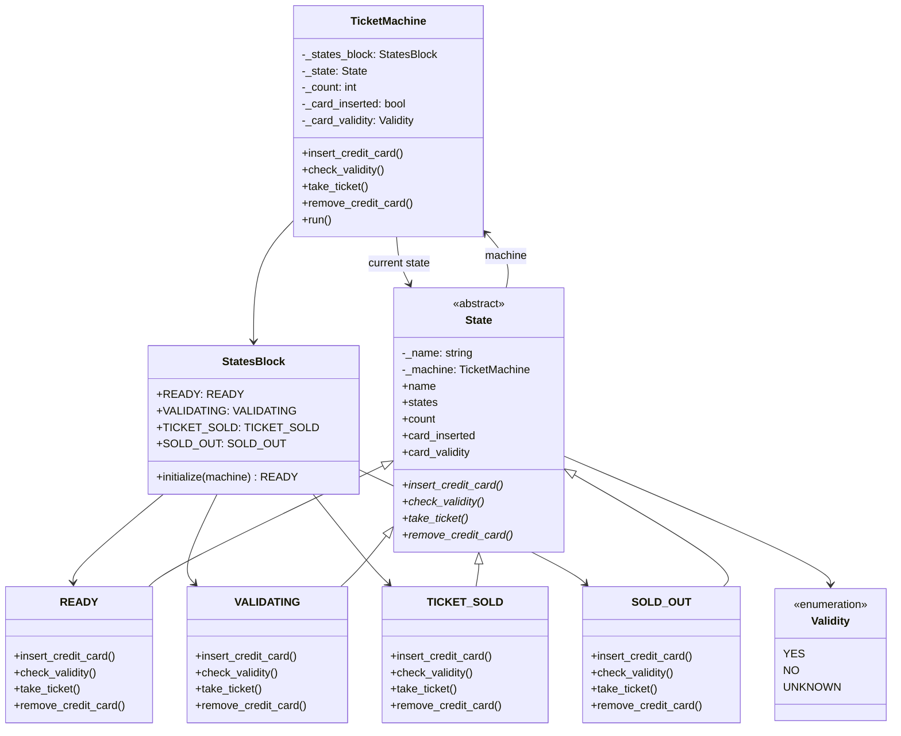

# Tickets Module - State Design Pattern Implementation

This module demonstrates the **State Design Pattern** in the context of a ticket vending machine for sports events. The machine manages ticket sales through different states, handling credit card validation, ticket dispensing, and sold-out conditions.

## Key Features:
- **State Pattern**: Encapsulates state-specific behavior and transitions
- **Dynamic State Changes**: Machine behavior changes based on current state
- **Finite State Machine**: Well-defined states and transitions
- **Context Management**: TicketMachine maintains current state and shared data

## How It Works:
- The `TicketMachine` (Context) starts in the `READY` state
- User interactions (insert card, check validity, take ticket, remove card) trigger state transitions
- Each state defines behavior for all possible actions:
  - **READY**: Accepts card insertion, waits for validation
  - **VALIDATING**: Simulates card validation (80% success rate)
  - **TICKET_SOLD**: Allows ticket dispensing, then returns to READY or SOLD_OUT
  - **SOLD_OUT**: Rejects all operations when tickets are exhausted
- State transitions occur based on user actions and machine conditions

## UML Diagram

## Design Pattern Implementation:
- **State Pattern**: Each state is a separate class implementing the State interface
- **Context**: TicketMachine delegates actions to the current state object
- **State Transitions**: States return the next state, which the context adopts
- **Shared State**: States access machine properties through the context
- **Singleton States**: State objects are created once and reused

This design allows easy addition of new states and behaviors without modifying existing code, following the Open/Closed Principle. The state machine ensures the ticket vending process is robust and handles edge cases like sold-out conditions and invalid cards.